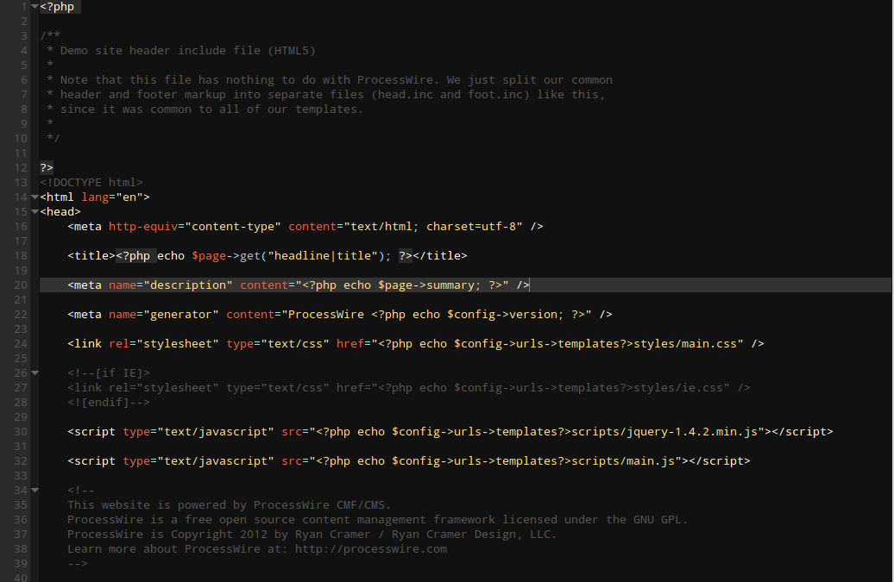

diogo-dark-theme
================

dark theme for Textadept http://foicica.com/textadept/

To install create a ~/.textadept/themes/ folder – if you don't have one already – and drop the theme inside it.

The theme uses Droid Sans Mono. Make sure you install the font also http://www.fontsquirrel.com/fonts/Droid-Sans-Mono

Used colors: http://color.hailpixel.com/#0A0A0A,1A1A1A,292929,994D4D,F6E492,05C9FF,B6F254,EEB3FF,E6994C,FFFFFF,BABABA,999999,545454,

